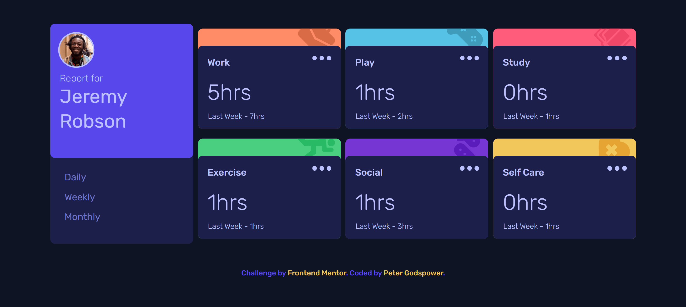
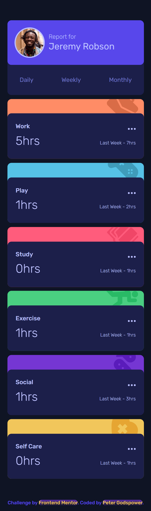

# Frontend Mentor | Time Tracking Dashboard

This is a solution to the Time Tracking Dashboard challenge on Frontend Mentor. The project involves creating a responsive time-tracking dashboard that displays user activities and time spent based on different timeframes (daily, weekly, monthly) with dynamic data updates.

## Table of Contents

- [Overview](#overview)
  - [Screenshot](#screenshot)
  - [Links](#links)
- [My Process](#my-process)
  - [Built With](#built-with)
  - [What I Learned](#what-i-learned)
  - [Continued Development](#continued-development)
  - [Useful Resources](#useful-resources)
- [Author](#author)
- [Acknowledgments](#acknowledgments)

## Overview

### Screenshot

### Links

- Solution URL: [Frontend Mentor Solution](https://www.frontendmentor.io/solutions/time-tracking-dashboard)
- Live Site URL: [Live Demo](https://your-live-site-url.com)

## My Process

I approached this project by focusing on creating a dynamic and responsive time-tracking dashboard that updates based on user interaction and displays data fetched from a JSON file.

### Built With

- Semantic HTML5 markup
- CSS custom properties for theming
- Flexbox and Grid for layout management
- Responsive design using `clamp()` and viewport-relative units (vw)
- Custom fonts - "Rubik" for typography
- JavaScript for dynamic data handling and interactive features

### What I Learned

This project reinforced my knowledge in:

- **Dynamic Data Handling:** Fetching and processing JSON data to dynamically update the UI.
- **CSS Variables:** Leveraging custom properties to maintain a consistent design and facilitate theming.
- **JavaScript Interactivity:** Implementing functionality for user interactions, including data display and active state management.
- **Responsive Design:** Creating fluid layouts that adapt to various screen sizes using modern CSS techniques.

### Continued Development

Future projects will focus on:

- **Advanced JavaScript Techniques:** Enhancing dynamic functionality and data handling in JavaScript.
- **Enhanced CSS Styling:** Exploring more complex CSS effects and animations.
- **Accessibility & Usability:** Improving accessibility and ensuring a seamless user experience across all devices.

### Useful Resources

- [MDN Web Docs](https://developer.mozilla.org/en-US/) - Comprehensive documentation for web development.
- [CSS-Tricks](https://css-tricks.com/) - Tutorials and articles on modern CSS techniques.
- [Frontend Mentor](https://www.frontendmentor.io/) - Challenges and community support for frontend development.

## Author

- **Frontend Mentor:** [@YourProfile](https://www.frontendmentor.io/profile/YourProfile)
- **GitHub:** [YourGitHubUsername](https://github.com/YourGitHubUsername)

## Acknowledgments

I would like to thank Frontend Mentor for this engaging challenge and the community for its valuable feedback and support.
